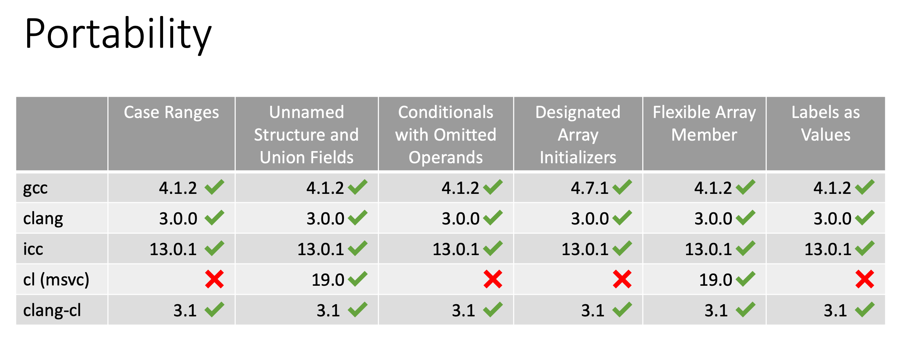

This directory contains non-conforming C++ code but sometimes supported by standard compilers.

More info in [CppCon 2019: Miro Knejp “Non-conforming C++: the Secrets the Committee Is Hiding From You”](https://youtu.be/IAdLwUXRUvg) and [slides](https://github.com/mknejp/talks/blob/master/CppCon/2019-Non-conforming-Cpp.pdf).

